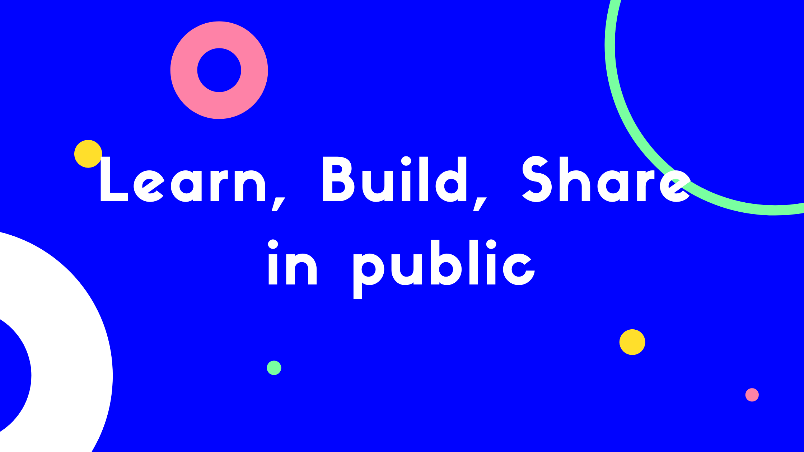

import VisionMadTweet from "./TweetCard";

I am always reading and learning new stuff, which helps me develop my insights and thoughts. Hence, building VisionMad NewsLetter in public to share my insights and learnings weekly.

Here is how I plan to implement it. I kept it pretty simple, no big talks and fancy words, only actionable and practical steps crafted after giving hours and days of thoughts behind it.

Divided my working hours into three equal slots: Learning, Building, and Sharing.

### Learning in public
My interest is in learning all sorts of skills that we were never taught in schools, but are essential for life. I don't know how to do my taxes, apply for a loan, purchase a home, things about investment, building credit, or getting a job.

[What is school for?](https://www.youtube.com/watch?v=_PsLRgEYf9E&t=69s)

I want to have a deep understanding of the following.
  - Algorithm / Programming
  - Animation / Html Canvas
  - Science / Mathematics
  - Writing / StoryTelling
  - Marketing / SEO
  - Design

It's going to be a life long journey to keep learning and keep sharing.

I have always felt that learning new stuff is pretty boring because of the way information is provided.
Hence I am trying to build a weekly newsletter where I will share my learnings in a fun and engaging way with images, GIF, illustrations, and animations.

### Building in public
For the first time, I am building a newsletter. So, if I reach 100 subscribers in the next three months, I will consider it a success.

[Where is your 100 true fans?](https://a16z.com/2020/02/06/100-true-fans/)

The name of the newsletter is **VisionMad**, which stands for **Vision** to **M**ake **A** **D**ifference.

The most important thing is to get started. So, my blog is using GatsbyJS and, free version of ConvertKit for NewsLetter. I will shift to paid versions once I start seeing some real potential with VisionMad. 

### Distribution Channels
I have done my research, and this is where most people fail. People mostly spend 90% time creating content and only 10% distributing it. The ratio for creation and distribution should be 50:50.

  - SEO - SEO should be the main distribution channel. Learning SEO as I implement it.
  - Twitter - Long-form content sharing. Commenting and engaging on others' tweets.
  - IndieHacker - Long-form content sharing. Commenting and engaging on others' posts. 
  - LinkedIn - Link sharing with images and GIF. Organic reach is good. Using hashtags properly can do wonders.
  - Facebook - Providing value to specific groups and pages with a direct link to the newsletter.
  - Quora - Posting detailed answers to related questions, letting them know about the newsletter in a humble tone.
  - Podcast - Convert the blog post to audio and publish on Anchor.
  - YouTube - Convert the podcast audio to video and upload.

I will figure out my main and secondary distribution channels as I experiment by sharing on these channels.

Inspiration for the distribution strategy came from a lot of readings. Here are two of the resource:
  - [How I promote my content](https://marketingexamples.com/content/sharing)
  - [8 social media post with just one content](https://www.indiehackers.com/post/how-to-create-8-social-media-posts-with-just-1-twitter-thread-including-a-podcast-yt-video-d935ea1af8)

I understand that I might fail, and I am ready for it. Anyway, in the end, I will have the experience to share.

Show some support to this twitter thread.

<VisionMadTweet />

All suggestions and feedback are welcome. Thanks for reading.

import NewsletterForm from "../../../src/components/NewsLetter";

     
<NewsletterForm />