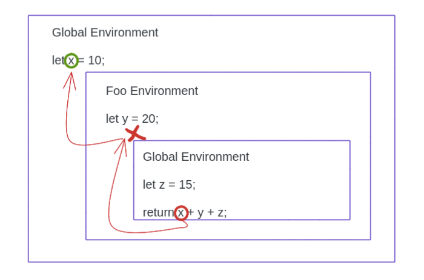

Hello Everyone,

In this post we will explore the HOF (Higher order function), Callbacks, and the crazy JavaScript Closures.

## Higher Order Function
A function which **accepts a function definition** as a parameter and/or **returns a function** is HOF (Higher Order Function).

For instance:
```js
function isEven(n) {
  return n % 2 === 0;
}

function printMsg(evenFunc, num) {
  const isEven = evenFunc(num);
  console.log(`The number ${num} is even: ${isEven}`);
}

printMsg(isEven);
```

In the above snippet **printMsg** is the **Higher Order Function**, because it accepts the isEven function as parameter.

## Callbacks
A callback is a function passed into another function as an argument to be executed later. In the last code snippet **isEven** is the callback function.

It is called **callback** because it calls back to the place where it was created.

Let's see one more example.
```js
let numbers = [1, 2, 4, 7, 3, 5, 6];

function isOddNumber(number) {
  return number % 2;
}

function oddNumbers = numbers.filter(isOddNumber);
console.log(oddNumbers); // [1, 7, 3, 5]
```

In the above code snippet **isOddNumber** is the callback function. Callback functions can be used to handle [Async JavaScript](./).

## Closures
From [execution context](./how-javascript-works-behind-the-scene-execution-context-and-call-stack), we know that after a function is returned, it is removed from the call stack and deleted from execution context. So, keeping that in mind, here is the definition of a closure.

A closure is a function which has access to the outer variables even after the outer function is returned.

```js
let x = 10;

function foo() {
  let y = 20;

  function bar() {
    let z = 15;
    return x + y + z;
  }

  return bar;
}

let test = foo();
test(); // 45
```

In the above code, **bar** is the closure function, which has access to outer variables (x and y) even after outer function is returned.

Simplified Closure Definitions:

- A closure is function which remembers the environment in which it was created.
- When a function is returned from an outer function, it carries the environment with itself.

Closures are possible in JS because of **Lexical Scoping**. Lexical scoping means, *If a variable is not found in the local scope, it looks in the outer scope, and so on till the global scope.*



### Exeption in closures
There is just one exeption in closures. In JavaScript every function is a closure except for functions created via "new Function" syntax.

Usually a function have access to the lexical environment where it was created. But when a function is created via the **"new Function"** syntax, it doesn't have access to the lexical environment but the global one.

```js
function getFunc() {
  let value = "test";

  let func = new Function('alert(value)');

  return func;
}

getFunc()(); // error: value is not defined
```

So, functions such as func (in above code) doesn’t have access to outer variables, only to the global ones.

------------------------

So, that's it for this post. I hope you learned something new, if so, please do share and join my email newsletter below or [here](./subscribe).

Thank You!