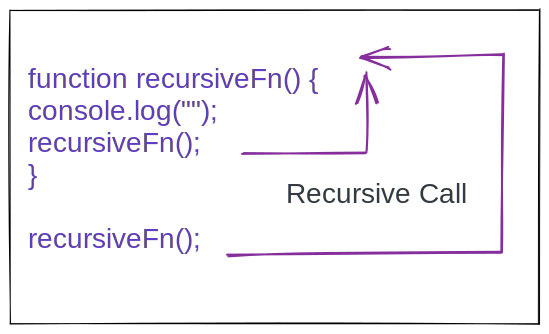

With this post I am starting a new series where I will cover all major DataSctructure and Algorithms in an easy and illustrative manner.

The terms in table of content might seem very scary, but just be with me I promise to explain everything in the simplest manner possible.

I will keep updating this post on a daily basis, till I cover everything mentioned in Table of content.

## Tabel of content:
- Big O Notation
	- [Understanding Big O Notation](#big-o-notation)
- Algorithms
	- [What is an algorithm and why to care?](#what-is-algo)
	- [Recursion](#recursion)
	- [Linear Search Algorithm](#linear-search)
	- [Binary Search Algorithm](#binary-search)
	- [Naive Search Algorithm](#naive-search)
	- [KMP Algorithm](#kmp-search)
	- [Bubble Sort](#bubble-sort)
	- [Merge Sort](#merge-sort)
	- Quick Sort
	- Radix Sort
- DataStructure
	- [What is DataStructure and why to care?](#what-is-ds)
	- Single linked list DS
	- Tree Traversal
	- Stack and Queues
	- Binary search trees
	- Binary Heap
	- Hash Tables
	- Graphs
	- Graph Traversal

## <a name="big-o-notation">Understanding Big O Notation</a>
Big O Notation is a way to represent the **time and space** complexity of an algorithm.

- Time Complexity: Time taken by the algorithm to complete the execution.
- Space Complexity: The memory occupied by the algorithm. 


There are few expressions (notations) which represents the time complexity of an algorithm.

- O(1): Constant time complexity. This is the ideal case.
- O(log n): Logarithmic time complexity. If `log(n) = x` then it is same as `10^x`
- O(n): Linear time complexity. Time increases with the number of input in a linear manner. For ex, If one input takes 1 ms, 4 inputs will take 4 ms to execute the algo.
- O(n^2): Exponential time complexity. This mostly happens in case of nested loops.
- O(n!): Factorial time complexity. This is the worst case senario, which should be avoided.

You should try to write your algorithm such that it can be represented by the first 3 notations. And last two should be avoided as often as possible.


You want to keep your complexity as low and straight as possible, ideally avoiding anything above O(n).

In further sections of this article you will see examples of each notation. For now this is all you need to know.

## Algorithm
### <a name="what-is-algo">What is algorithm and why to care?</a>
The way to solve a problem or we can say the **steps**, **procedure**, or **set of rules** to solve a problem is known as Algorithm.

<blockquote>ex: Search Engine algorithm to find out data related to a search string.</blockquote>

As a programmer you will come across many problems that needs to be solved with these algorithms. So, it's better if you already know them.

### <a name="recursion">Recursion</a>
A function calling itself is recursion. Think of it as an alternative to loop.

```js
function recursiveFn() {
	console.log("This is a recursive function");
	recursiveFn();
}

recursiveFn();
```
In the above snippet look at line 3 recursiveFn is called in recursiveFn itself. As I mentioned earlier recursion is an alternative to loop.

So, how many times this function is exactly going to run?

Well,  this will create an infinite loop, because there is nothing to stop it at any point.



Let's say we need to run the loop only 10 times. On the 11th iteration function should return. That will stop the loop.

```js
let count = 1;
function recursiveFn() {
	console.log(`Recursive ${count}`);
	if (count === 10) return;
	count++;
	recursiveFn();
}

recursiveFn();
```
In the above snippet line 4 returns and stops the loop at count 10.

Now let's see a more realistic example. Our task is to return an array of odd numbers from a given array. This can be achieved in a number of ways including for-loop, Array.filter method, e.t.c

But to showcase the use of recursion I will use a helperRecursive function.

```js
function oddArray(arr) {
    let result = [];
    function helperRecursiveFn(arr) {
        if(arr.length === 0) {
            return; // 1
        } else if(arr[0] % 2 !== 0) {
            result.push(arr[0]); // 2
        }
        helperRecursiveFn(arr.slice(1)); // 3
    }
    helperRecursiveFn(arr);
    return result;
}

oddArray([1, 2, 3, 4, 5, 6, 7, 8, 9, 10]);
// OutPut -> [1, 3, 5, 7, 9]
```
Here the recursive function is helperRecursiveFn.
1. Return if the array length is 0.
2. Push the element to result array if the element is odd.
3. Call helperRecursiveFn with **first element of array sliced**. Every time the first element of array will be sliced, because we have already cheked it for odd or even.

For ex: First time helperRecursiveFn will be called with **`[1, 2, 3, 4, 5, 6, 7, 8, 9, 10]`**. Next time it will be called with **`[2, 3, 4, 5, 6, 7, 8, 9, 10]`** and so on untill the array length is 0. 

### <a name="linear-search">Linear Search Algorithm</a>
Linear search algorithm is pretty simple. Say that you need to find if a number exists in a given array or not.

You will run a simple for loop and check every element untill you find the one you are looking for.

```js
const array = [3, 8, 12, 6, 10, 2];

// Find 10 in the given array.
function checkForN(arr, n) {
	for(let i = 0; i < array.length; i++) {
		if (n === array[i]) {
			return `${true} ${n} exists at index ${i}`;
		}
	}

  return `${false} ${n} does not exist in the given array.`;
}

checkForN(array, 10);
```

That's linear search algorithm. You search for each element in the array one by one in a linear manner.


#### Time Complexity of Linear Search Algorithm
There is only one for loop which will run n times. Where n (in worst case) is the length of the given array. Here number of iterations (in worst case) is directly propotional to the input (array of length).

Hence the time complexity for linear search algorithm is **Linear Time Complexity: O(n)**.

### <a name="binary-search">Binary Search Algorithm</a>
In linear search you can eliminate one element at a time. But with binary search algorithm you can eliminate multiple elements at once. That's why binary search is faster than linear search.

<blockquote><strong>The point to be noted here is that binary search works only on sorted array</strong>.</blockquote>

This algorithm follows divide and conquer approach. Let find the index of 8 in [2, 3, 6, 8, 10, 12].

**Step 1:**
Find the middleIndex of the array.
```js
const array = [2, 3, 6, 8, 10, 12];
let firstIndex = 0;
let lastIndex = array.length - 1;
let middleIndex = Math.floor((firstIndex + lastIndex) / 2); // middleIndex -> 2
```

**Step 2:**
Check if middleIndex element > 8. If so, that means 8 is on the left of middleIndex. Hence, change lastIndex to (middleIndex - 1).

**Step 3:**
Else if middleIndex element < 8. That means 8 is on the right of middleIndex. Hence, change firstIndex to (middleIndex + 1);
```js
if (array[middleIndex] > 8) {
	lastIndex = middleIndex - 1;
} else {
	firstIndex = middleIndex + 1;
}
```

**Step 4:**
With every iteration middleIndex is again set as per the new firstIndex or lastIndex.

Let's see all those steps together in code format.

```js
function binarySearch(array, element) {
	let firstIndex = 0;
	let lastIndex = array.length - 1;
	let middleIndex = Math.floor((firstIndex + lastIndex) / 2);
	
	while (array[middleIndex] !== element && firstIndex <= lastIndex) {
		if(array[middleIndex] > element) {
				lastIndex = middleIndex - 1;
		}else {
				firstIndex = middleIndex + 1;
		}
		middleIndex = Math.floor((firstIndex + lastIndex) / 2);
	}
	return array[middleIndex] === element ? middleIndex : -1;
}

const array = [2, 3, 6, 8, 10, 12];
binarySearch(array, 8); // OutPut -> 3
```

Here is visual representation of the above code.

**Step: 1**

```js
firstIndex = middleIndex + 1;
```

**Step: 2**

```js
lastIndex = middleIndex - 1;
```

**Step: 3**

```js
array[middleIndex] === 8 // Found It
```


#### Time Complexity of Binary Search
There is only one while loop which will run n times. But here number of iterations does not depend on the input (array length).

Hence the time complexity for binary search algorithm is **Logarithmic Time Complexity: O(log n)**. And you can check the O-notation graph. O(log n) is faster than O(n).

### <a name="naive-search">Naive Search Algorithm</a>
Naive search algorithm is used to find if a string contains a given substring. For example, check if "helloworld" contains the substring "owo".

1. First loop on the main string ("helloworld").
2. Run a nested loop on the substring ("owo").
3. If character does not match then break inner loop else keep looping.
4. If inner loop is completed and got a match, then return true else keep the outer loop going.

Here is a visual representation.


Here is the implementation in code.

```js
function naiveSearch(mainStr, subStr) {
	if (subStr.length > mainStr.length) return false;

	for(let i = 0; i < mainStr.length; i++) {
       for(let j = 0; j < subStr.length; j++) {
            if(mainStr[i + j] !== subStr[j]) break;
            if(j === subStr.length - 1) return true; 
        }
    }
    return false;
}
```

Now, let's try to understand the code above.

- At line 2, return false if subString length is greater than mainString length.
- At line 4, start looping on mainString.
- At line 5, start nested loop on subString.
- At line 6, break inner loop if no match is found, And move on to next iteration for outer loop.
- At line 7, return true at last iteration of inner loop.

#### Time Complexity of Naive Search
There is a loop inside a loop (Nested Loop). Both loop run n times. Hence time complexity for naive search algo is (n * n) **Exponential Time Complexity: O(n^2)**.

And as discussed at top, any time complexity above O(n) should be avoided if possible. We will see a better approach with less time complexity in next algo.

### <a name="kmp-search">KMP Algorithm</a>
KMP algo is a pattern recongnition algorithm, and it is a bit tough to understand. Ok, let's try to find if the string "abcabcabspl" contains the sub string "abcabs".

If we try to solve this with **Naive Search Algo**, it will match for first 5 characters but not for 6th character. And we will have to start over again with next iteration, we will lost all the progress in previous iteration.


So, in order to save our progress and use it, we must use something called LPS table. Now in our matched string "abcab" we will find the longest same prefix and suffix.

Here, in our string "abcab" **"ab"** is the longest same prefix and suffix.


Now, we will begin the next search iteration from index 5 (for main string). We saved two characters from our previous iteration.


In order to figure out the prefix, suffix, and where to start next iteration from we use LPS table.

LPS for our substring ("abcabs") is "0 0 0 1 2 0".


Here is how to calculate LPS table.

```js
function calculateLpsTable(subStr) {
    let i = 1;
    let j = 0;
    let lps = new Array(subStr.length).fill(0);

    while(i < subStr.length) {
        if(subStr[i] === subStr[j]) {
            lps[i] = j + i;
            i += 1;
            j += 1;
        } else {
            if(j !== 0) {
                j = lps[j - 1];
            } else {
                i += 1;
            }
        }
    }
    return lps;
}
```

Here is the implementation in code using LPS table.

```js
function searchSubString(string, subString) {
    let strLength = string.length;
    let subStrLength = subString.length;
    const lps = calculateLpsTable(subString);

    let i = 0;
    let j = 0;

    while(i < strLength) {
        if (string[i] === subString[j]) {
	        i += 1;
	        j += 1;
        } else {
            if (j !== 0) {
                j = lps[j - 1];
            } else {
                i += 1;
            }
        }
        if (j === subStrLength) return true;
    }

    return false;
}
```

#### Time Complexity of KMP Algorithm
There is only one loop which run n times. Hence time complexity for KMP algo is **Linear Time Complexity: O(n)**.

Notice how time complexity is improved as compared to that of Naive search algo.

### <a name="bubble-sort">Bubble Sort Algorithm</a>
Sorting means rearranging data in ascending or descending order. Bubble sort is one of many sorting algorithms.

In bubble sort algo, we swap the larger number to the end by comparing each number with the previous number. Here is a visual representation.


Bubble sort code implementation.

```js
function bubbleSort(array) {
    let isSwapped;

    for(let i = array.length; i > 0; i--) {
        isSwapped = false;

        for(let j = 0; j < i - 1; j++) {
            if(array[j] > array[j + 1]) {
                [array[j], array[j+1]] = [array[j+1], array[j]];
                isSwapped = true;
            }
        }

        if(!isSwapped) {
            break;
        }
    }
    return array;
}
```

Let's try to understand the above code.

- Looping from end of array with variable i towards beginning.
- Start inner loop with variable j until (i - 1).
- If array[j] > array[j + 1] swap them.
- return sorted array.

#### Time Complexity of Bubble Sort Algorithm
There is a nested loop and both loop runs n times, so time complexity for this algo is (n * n) that is **Exponential Time Complexity O(n^2)**.

### <a name="merge-sort">Merge Sort Algorithm</a>
Merge sort algorithm follows divide and conquer approach. It's a combination of two things - merge and sort.

In this algo first we divide main array into multiple indivisual sorted arrays.


Then we merge the indivisual sorted elements together into final array.

Let's look at the implementation in code.

Merge Sorted Array
```js
function mergeSortedArray(array1, array2) {
    let result = [];
    let i = 0;
    let j = 0;

    while(i < array1.length && j < array2.length) {
        if(array1[i] < array2[j]) {
            result.push(array1[i]);
            i++;
        } else {
            result.push(array2[j]);
            j++;
        }
    }

    while (i < array1.length) {
        result.push(array1[i]);
        i++;
    }

    while (j < array2.length) {
        result.push(array2[j]);
        j++;
    }

    return result;
}
```

The above code merges two sorted array into a new sorted array.

Merge Sort Algorithm
```js
function mergeSortedAlgo(array) {
    if(array.length <= 1) return array;

    let midPoint = Math.floor(array.length / 2);
    let leftArray = mergeSortedAlgo(array.slice(0, midPoint));
    let rightArray = mergeSortedAlgo(array.slice(midPoint));

    return mergeSortedArray(leftArray, rightArray);
}
```

The above algo uses recursion to divide the array into multiple single element array.

#### Time Complexity of Merge Sort Algorithm
Let's try to calculate time complexity of merge sort algorithm. So, taking our previous example ([6, 3, 5, 2]), it took 2 steps to divide it into multiple single element array.

**```It took 2 steps to divide an array of length 4 - (2^2)```**.

Now if we double the length of array (8), it will take 3 steps to divide - (2^3). Means doubling the array length didn't doubled the steps.

Hence time complexity of merge sort algorithm is **Logarithmic Time Complexity O(log n)**

## DataStructure
### <a name="what-is-ds">What is DataStructure and why to care?</a>
DataStructure is the way to organize your data. Different operations (CRUD) performs better with different DataStructures.

So, it is very important to know which DS is right for a particular use case.

---
I am updating this post daily with one DS / Algo topic. If this is helpful to you in any way, consider sharing with your social media network.

Thank You!