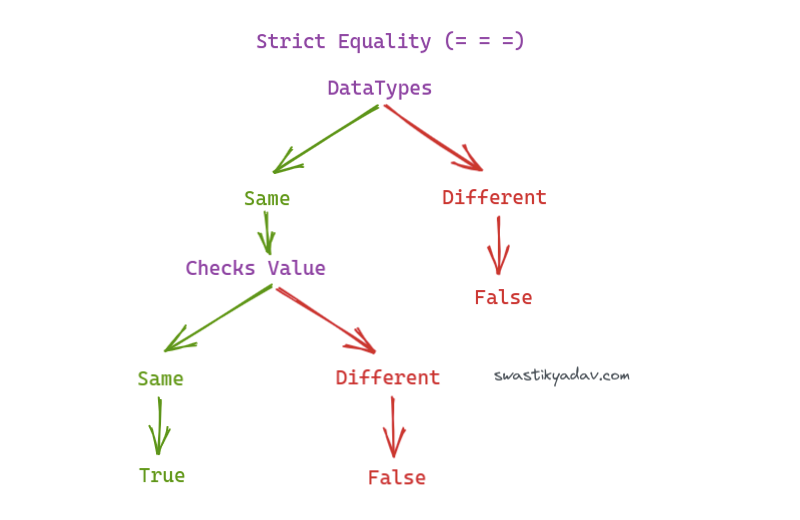
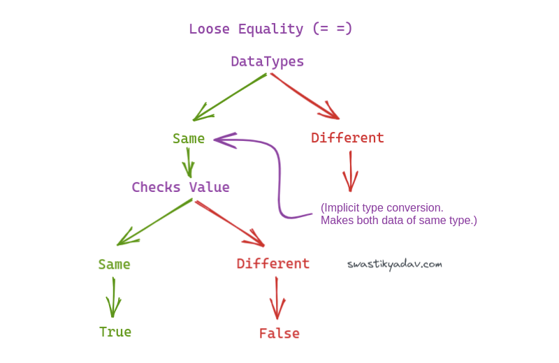

Hello Everyone!

In this post we will explore the difference between JS **loose equality (==)** and **strict equality (===)** check.

Here is the simplest definition

- *Loose equality (==) checks for value only.*
- *Strict equality (===) checks for value as well as DataType.*

But wait, there is something more to it. Let's understand the workings of both of them one by one.

## Strict Equality (===)
Strict equality first checks for DataType, If datatype is same then it checks for value, else it returns false.

Ex:
```js
console.log("55" === 55);
// false - Because datatype is different even though value is same.
```



## Loose Equality (==)
Loose equality works similar to strict equality. The only difference is that in loose equality if datatype is different, it performs an **Implicit type conversion** and then compares the value.

Ex:
```js
console.log("55" == 55);
// true - Because implicit conversion will change string "55" to number 55 then compare value.
```



If you enjoyed or found this post helpful, please consider joining my weekly Newsletter below.

Thank You!