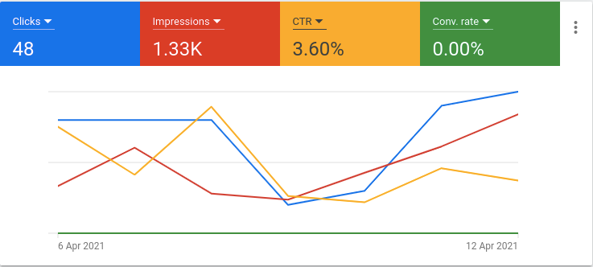

I am writing this because recently I was feeling very anxious and depressed. You see we live in a society where everyone needs instant gratification. (Btw, that's why they call it Instagram, the short for instant gratification)

But Entrepreneurship and creating something meaningful is a long haul.

I was working on a project and the lack of expected results made me anxious and depressed.

### The Project
ThemeForest sells all sorts of themes and templates. My idea was to niche down only for Html email templates. That's what I did at https://buyemailtemplate.com.

The primary keyword search volume is 1k - 10k / month. I tested the Ideas with GoogleAds for 1 week and here is the result.

7 days and not even a single conversion (sale). Now that hurts!

And throughout these 7 days, my thinking was very result-oriented which made me anxious and depressed.

But thankfully I stumbled upon this Geeta verse which brought me on the right track.

> `To action alone hast thou a right and never at all to its fruits; let not the fruits of action be thy motive; neither let there be in thee any attachment to inaction.`

### What went wrong with the project?
Well, I had my research done, but there are few things that I learned after failing.

#### Search Intent
Google has this concept of search intent where the algorithm tries to figure out the intent of the searcher.

Here are the common search intents.
- Informational (Searcher just want some information)
- Transactional (Searcher is willing to take some action)
- Commercial (Searcher wants to buy something)

It is very important to know the search intent of the users who are searching for your product on google.

And the search intent for `Html email templates` is informational. So, they are not gonna buy it.

#### Build an audience first
Ideally, I shouldn't have relied on Google Ads. But should have first built an audience. Find your [100 ture fans](https://a16z.com/2020/02/06/100-true-fans/). These are people  that benefits from your solution a disproportionate amount.

Brian Chesky, CEO of Airbnb, once said: “Build something 100 people
love, not something 1 million people kind of like.”

But, anyways I learned about Search Intent and building an audience first. And with that in mind, I am ready to test out my next idea.

Stay Tuned!

import Subscription from "@narative/gatsby-theme-novela/src/components/Subscription";

<Subscription />