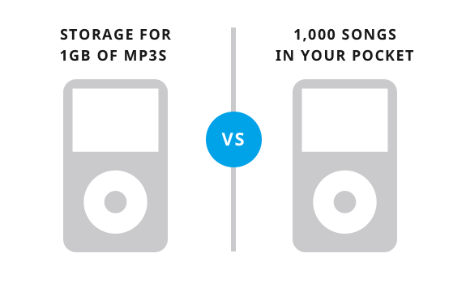

import Tweet from "./TweetCard";

Freedom, value, and wealth are related. You can pursue freedom and acquire wealth for yourself while providing value to others.

We use the word value without actually thinking much about it. It is often described as materialistic things, money, and anything desirable and worth created through exchange or effort. But it is much more than that. In the context of business, value is about helping people.

### The feature is descriptive, and the value is emotional.

Businesses often talk about the features of their product and services. But what should be talked about is the value customers receive.

Features are descriptive. It is like being a salesman and knocking door to door. Whereas benefit relates to emotional needs, it attracts the customers.

See the example below. Ipod's feature v/s it's value.

Few more examples:

|   Businesses  |    Features   |    Benefits   |
| ------------- | ------------- | ------------- |
| The Mogul Mom | Resources for mom Entrepreneurs | Stay home with your kids and earn a good income without going into debt. |
| Design by Reese | Website and graphic design | Your brand is more than a website. We'll help you tell a story that communicates your core mission. |
| Hazel Tree Interiors | Interior design services | Make your home a restful sanctuary, a place your whole family enjoys. |
| Spredsheet templates | Excelsheet templates | Become an office superhero: Help your colleagues and get your work done quickly. |

The more we focus on core benefits instead of dull features, the more customers will connect.

### How to create value to pursue freedom and acquire wealth?

Value is created when you build something useful and share it with a group of people to help them. As simple as that.

If you look around carefully, you will find a pattern. ***Entrepreneurs are creating value, acquires wealth from it, which sets them free***.

- Dig deeper to uncover hidden needs. Research to find what your customers want.
- Sell what people want. More than often, what customers says and what they want is different.

Those were my thoughts, inspired from the book $100 StartUp.

If you enjoyed it please show some love to this post on twitter.

<Tweet />

Thanks for reading.

import NewsletterForm from "../../../src/components/NewsLetter";

     
<NewsletterForm />