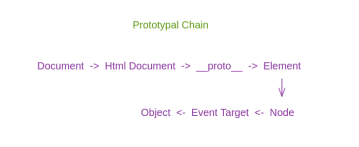

Hello Everyone,

In this post we will explore the **object oriented programming** paradigm in JavaScript. OOP is a paradigm where everything is managed with objects.

There are four ways to work with objects in JavaScript:

- Factory way of creating objects.
- Prototypal way of creating objects.
- Pseudo Classical pattern of creating objects.
- Classes

The best way to work with objects are classes. We will learn exactly how classes works. Let's explore each method one by one.

## Factory way of creating objects
Let's say we need to create multiple students object. With factory way, we don't manually need to create objects for all of them. We create a constructor function.

```js
function creteStudent(name, batch, marks, maxMarks) {
    let obj = {};
    obj.name = name;
    obj.batch = batch;
    obj.marks = marks;
    obj.maxMarks = maxMarks;
    obj.percentage = function() {
        return `${(marks*100)/maxMarks}%`;
    };

    return obj;
}
```

Next whenever we need to create a student, we just have to call the above function.

```js
let student1 = createStudent("Swastik", 9, 95, 100);
let student2 = createStudent("Rahul", 8, 90, 100);

student1.percentage() // 95%
```

This was the factory way of creating objects.

## Prototypal way of creating objects
When a property is not found in an object, it looks for it down in the prototypal chain. This is the **prototypal nature of object**.



Now let's create object the prototypal way.

1. Create object using **Object.create()**.
2. Make sure to use **this** in the method.
3. Make sure to return object.

```js
let studentMethod = {
  percentage: function() {
    return `${this.marks*100 / this.maxMarks}%`;
  }
}

function createStudent(name, batch, marks, maxMarks) {
  let obj = Object.create(studentMethod);
  obj.name = name;
  obj.batch = batch;
  obj.marks = marks;
  obj.maxMarks = maxMarks;

  return obj;
}

let student1 = createStudent("Swastik", 9, 99, 100);
student1.percentage(); // 99%
```

Object.create takes an object as parameter and puts that parameter into dunder-proto. For example in the above code snippet percentage method is added in dunder proto, it is not in the main object.