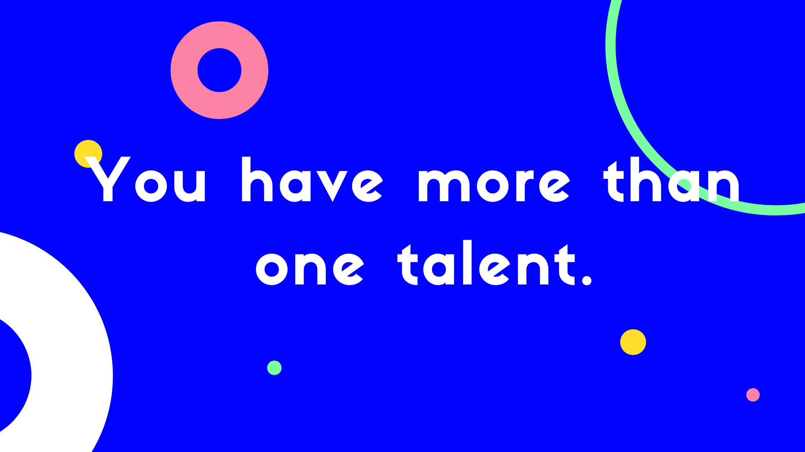

import PersonalMonopolyTweet from "./TweetCard";

Let me ask you a question. How do you get into the top one percent of your discipline?

You might think that the only way is to keep working harder and gain enough knowledge of your discipline. But no matter what, someone will always be ahead of you in your game. So, how do you reach the top 1% of your discipline?

Let's figure it out.

### Identify your personal monopoly.

Develop a different set of skills that make you unique. This concept is called **Talent Stack** by Scott Adams, **Personal Moat** by Eric Torenberg, and **Personal Monopoly** by David Perell.

A different unique set of skills collected in one person creates value.

For Instance:

As in the case of Scott Adams. The world has plenty of better artists, smarter writers, funnier humorists, and more experienced business people. The rare part is that each of those modest skills is collected in one person. That's how value is created and you get to the top 1%.

Another Instance:

Teachers are good at more than just teaching. They're also good at communication, adaptability, crowd control, lesson planning, and coordinating among different interest groups.

These skills can also be put to good use in building a business.

And if you feel like you don't have a personal monopoly, don't worry that's what learning is for.

### What is my personal monopoly?

Now you might be asking do I have a personal monopoly.

Well, I am still trying to figure it out. But here are a few skills I am learning.

- Web Development (Learning)
- Writing / StoryTelling (Learning)
- Animation / Illustration / Html5 Canvas (Learning)
- Finance (Learning)
- I think I am also good at explaining and presenting the knowledge I have. (Did that a few times at [Learnist](https://twitter.com/thelearnist), No more active)

I might create something unique with the above Talent Stack or might not. But the quest is on, and that's the whole point.

### Tie your Identity to your name.
Nothing is more powerful than tying your identity with your name. Because nobody can take that away from you.

As James Clear says in Atomic Habits.

- The goal is not to write but to become a writer.
- The goal is not to read but to become a reader.
- The goal is not to speak but to become a speaker.
- The goal is not to write a program but to become a programmer.
- The goal is not to illustrate but to become an illustrator.

Now it's your turn to fill in the blank.

- The goal is not to **____** but to become a **____**

Further Readings

- [https://productlessons.substack.com/p/how-to-develop-your-talent-stack](https://productlessons.substack.com/p/how-to-develop-your-talent-stack)
- [https://ckarchive.com/b/lmuehmhem2e2](https://ckarchive.com/b/lmuehmhem2e2)
- [https://twitter.com/polina_marinova/status/1347661682726871041?s=20](https://twitter.com/polina_marinova/status/1347661682726871041?s=20)

So, that's it for this post. Let me know your thoughts on this topic. And hit reply and send me an email about your personal monopoly.

Thanks for reading. If you enjoyed it, please like and retweet this tweet. It will mean a lot.

<PersonalMonopolyTweet />

All suggestions and feedback are welcome. Thanks for reading.

import NewsletterForm from "../../../src/components/NewsLetter";

     
<NewsletterForm />