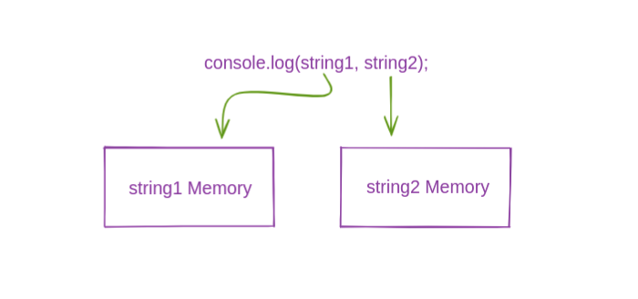

Hello Everyone

When we copy a datatype in JavaScript, there are two different ways the datatype can be copied - **by value or by reference**.

In this post we will explore what it means to copy by value and copy by reference.

## Copy by value
All primitive datatypes are copied by value. Let's see an example.

```js
let string1 = "Hello";

let string2 = string1;

console.log(string1, string2);
// Hello Hello

string1 = "World";

console.log(string1, string2);
// World Hello
```

In the above code string2 copies the value of string1, and when value of string1 changes it does not affect the copied value of string2 because **both string1 and string2 refers to different points in memory**.



That's what it means to copy by value.

## Copy by reference
Objects are copied by reference. Let's see an example.

```js
let person1 = {
  name: "Swastik",
  age: 22,
}

let person2 = person1;

console.log(person1["name"], person2["name"]);
// Swastik Swastik

person1["name"] = "Rahul";

console.log(person1["name"], person2["name"]);
// Rahul Rahul
```

In the above code snippet person2 copies the reference of person1, so **when person1 changes it also affects the person2** because **both person1 and person2 refers to the same point in memory**.


That's what it means to copy by reference.

------------------------------------------

If you want to learn more about duplicating and cloning JavaScript primitives and objects, please read this article - [Shallow cloning vs Deep cloning](./shallow-cloning-vs-deep-cloning)

------------------------------------------

Thank You, for reading. If you found this post helpful please do share and subscribe to my newsletter below or [here](./subscribe).