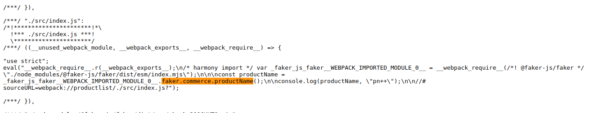
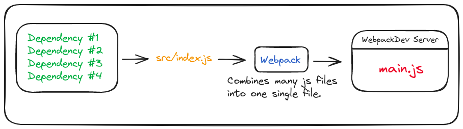

If you have been working with JS for a while, you must have came across webpack. Might have used it as well, but didn't actually know what it does.

At least for me it didn't made sense when I first tried it. I just copied & pasted config files from internet and somehow made it to work.

Infact that is the reason for tools like "create-react-app" to exist. Because it was too complex for beginners to setup a React app from scratch with webpack.

So, let's understand what's the deal with webpack.

We are going to build a small Product-Listing app and understand webpack in the proccess.

## Initiating Product-Listing App.
Let's start by setting up our project folders.

```bash
mkdir productList
cd ./productList
mkdir public src
```

We will work with "src" and "pulic" folders later. For now we will initiate vanilla JS project.

```bash
npm init
```

The above command will ask few questions, just accept all default configs. Now we have a package.json file in our project.

#### Installing Dependencies
Run the following command in project directory. We will talk about each dependency later.

```bash
npm install faker html-webpack-plugin webpack webpack-cli webpack-dev-server
```

#### Adding entry HTML and JS files.

```git-bash
cd ./public
touch index.html
// This simply creates index.html file in public folder.
```

Inside the `public/index.html` all we need to do is add a root element.

```html
<html>
  <body>
    <div id="root"></div>
  </body>
</html>
```

Now we add "index.js" inside `src` folder.

```git-bash
cd ./src
touch index.js
// This simply creates index.js file inside src.
```

Inside `src/index.js` import "faker" and console a fake productName. Faker just provides some fake data to work with. Nothing fancy here.

```js
import faker from "faker";

const productName = faker.commerce.productName();

console.log(productName, "pn++");
```

Okay, now if we try to execute this file in terminal. We will get an error.
You can add this js file as script in `index.html` but that's not what we want. Neither that will be able to import faker from node_modules.

By the way we can execute the above file with "CJS require". But instead let's just make the "ESM import" work with webpack.

## Webpack Configuration
Create a new file `webpack.config.js` in the root of project directory.

```git-bash
touch webpack.config.js
```

Now let's configure webpack and understand the installed packages.

```js
// Require HtmlWebpackPlugin
const HtmlWebpackPlugin = require("html-webpack-plugin");

module.exports = {
    // mode will change to "production" in `webpack.prod.js`
    mode: "development",
    // port where our main.js will become available.
    devServer: {
        port: 8081,
    },
    plugins: [
        new HtmlWebpackPlugin({
            // Whatever file names coming out from webpack will be used as the entry point.
            // And will be added as script to the template (public/index.html).
            template: "./public/index.html",
        })
    ],
}
```

#### webpack-dev-server
WebpackDevServer takes main.js (output by webpack) and makes it available to the browser.

#### html-webpack-plugin
HtmlWebpackPlugin takes whatever file name webpack generates (main.js) and adds it as script in `/public/index.html`.

Change the start script in `package.json`.

```json
//...rest of code...
"scripts": {
    "start": "webpack serve"
  }
//...rest of code...
```

Run the start script.

```bash
npm run start
```

Now the `main.js` is available on the browser. Open *http://localhost:8081/main.js* in browser. We can see the source code generated by webpack. If we search we will find our productList code and faker package as well in this file.



Hmm, nice. Now just open *http://localhost:8081*. This will serve `index.html` file with `main.js` added as script in html file.

Open console and see the productName appear there. Let's show productName on the screen. Make following changes in `src/index.js`.

```js
import { faker } from "@faker-js/faker";

const rootElm = document.querySelector("#root");

function mount(elm) {
  let products = "";

  for(let i = 0; i < 3; i++) {
    const productName = faker.commerce.productName();
    products += `<div>${productName}</div>`;
  }

  elm.innerHTML = products;
}

mount(rootElm);
```

Checking *http://localhost:8081* on browser should show product lists on the screen.

Alright, let's see some explanation around webpack.

## Webpack Explanation

Normally we would have to load many different files on the browser. For ex, if our application uses multiple files and external libraries. We would have to load each file on the browser.

As a rule of thumb, we should not load many diff files on browser. And that's where webpack comes in.

Webpack *`combines/bundles`* all those files into single file which can be loaded on the browser.



`main.js`/`bundle.js` not only contains our `src/index.js` code but all other imported dependency code as well.

Webpack officially calls themselves a "module bundler". Not only scripts, but it helps you bundle styles and assets as well.

--------------

So, that is all for this post. Hopefully this was a good read for you.

Thank You!