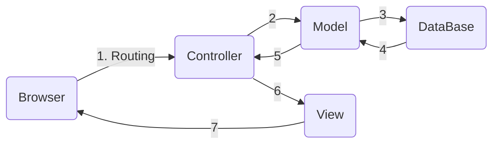

This blog post will explore the work flow of a **Rails Application**. If you are familiar with rails app, then you might know that scaffold creates entire CRUD operation for you. So, let's dive in and try to understand how things works under the hood.

## Rail Concept

Rails uses two main concepts.

1. DRY - Don't repeat yourself
2. Convention over configuration - Rails provide default ways of doing everything. Rails default ways follows all the best practices. (In short Rails is opinionated)

Rails have 3 environment.

1.  Development - For development purpose, creates a development DataBase.
2.  Production - Live application, DataBase is hosted.
3.  Test - For testing purpose, creates a test DataBase.

## Rails MVC

Rails follows the MVC pattern. Which is an architecture for web development. Stands for Model View Controller. (Another famous development architecture is Flux)

### Model (Active Record)

Model communicates to database. All DB related code goes into model folder.

In Rails app, model part is **[Active Record](https://guides.rubyonrails.org/active_record_basics.html)** class.

#### ORM (Object-Relational-Mapping)

ORM libraries map database tables to classes. Basically it helps in using **object oriented language** with **SQL** database. Active Record is the ORM layer supplied with Rails.

- Tables map to classes
- Rows map to objects
- Columns map to object attributes

#### Foreign_key

Foreign_key constraint is used so that a table has only valid reference of other table. These are the fields where Active-Record will look when we create associations between models.

For instance, We want all articles to be deleted when a user is deleted. So, we use `validates :dependent => :destroy` but we can't rely on this validation, because this is validation at the Rails app level. What about the validation at DB level, that's where Foreign_key constraint comes.

Adding foreign_key constraint.

```ruby
def change
  add_foreign_key :posts, :users
end
```

### View

View is the part responsible for whatever is seen on the browser. By default rails uses embedded Ruby (erb) for views. But we can change that, for example we can use **React JS** as view part.

Just like how HTML is combined into `Elements`, `Tags`, and `Attributes`. ERB is composition of three Rails elements namely `Templates`, `Partials` (to break and manage code into manageable chunks), `Layouts`.

### Controller

The main role of controller is to connect Model and View. It holds the logic of the application. It makes the model data available to the view so it can display that data to the user, and it saves or updates user data to the model.

In Rails app, controller part is **Action Controller** class.

Controller (ruby class) inherits from ApplicationController, and has methods called actions, like new, create, update, and destroy.

```ruby
class ExampleController < ApplicationController
    # Defining 'new' action in ExampleController
    def new
    end
end
```

#### Parameters

To access data sent by user or other parameters in controller actions we use **params** hash (objects are called hash in ruby). Rails provide all that data to us in params hash.

##### Strong Parameters

We don't want our users to be able to modify all values in params hash. So, **strong parameter** forbids the modification of params hash by user, until it is permitted. We can permit only specific data to be changed in params hash. Of course this is all because of security reasons.

```ruby
def person_params
    params.require(:person).permit(:name, :age)
end
```

#### Private Methods

Private methods can only be used within the class definition. Think of it as internal helper method. Also it can be used to keep some info secure and private.

Strong parameter is defined as private method.

#### Session

Rails application has a session for each user where we can store small amount of data that will be persisted between requests. Session is only available in controller.

Rails will not allow you to pass the session ID in the URL as this is less secure. You must use cookie, All session stores use a cookie to store a unique ID for each session.

```ruby
class LoginsController < ApplicationController
    # Create a session when user logs in
    def create
	if user = User.authenticate(params[:username, params[:password]])
	session[:current_user_id] = user.id
	redirect_to root_url
    end
end
```

## General flow of Rails app.



1.  Request made at browser.
2.  Request received at router of rails app.
3.  Request routed to appropriate controller.
4.  Controller either renders a view template or communicate with model.
5.  Model communicates with database.
6.  Model sends back info to controller.
7.  Controller renders view.

Now let's see how to create and handle routes, models and controllers.

## Generating and running Migration

Migrations are a way to alter your database in a structured and organized manner. Rails provide generators to generate migration and to run a migrations we use following command. `rails db:migrate`

Example of a generated migration file.

```ruby
class CreateProducts < ActiveRecord::Migration
    def up
        create_table :products do |t|
	    t.string :name
	    t.text :description

	    t.timestamps
        end
    end

    def down
        drop_table :products
    end
end
```

This creates a table named `products` in database, and down function is to remove the table from database. Rails new change method does the same job as the above code, but there we need not to specify up and down method separately. It knows to remove the table from DB on rollback.

```ruby
class CreateProducts < ActiveRecord::Migration
    def change
        create_table :products do |t|
	    t.string :name
	    t.text :description

	    t.timestamps
        end
    end
end
```

### Creating a standalone migration.

If you are creating a migration for different purpose, for instance to add new column to existing table, we use the migration generator.
`rails generate migration AddPartNumberToProducts part_number:string price:decimal`
This will generate the following code in a file named `yyyymmddhhmmss_add_part_number_to_products.rb`

```ruby
class AddPartToNumberToProducts < ActiveRecord::Migration
    def change
        add_column :products, :part_number, :string
        add_column :products, :price, :decimal
    end
end
```

## Generating and handling Models

We can manually create model file but rails provide a generator to create model file. `rails generate model your_model_name`

This will create a new file in app folder. `app/models/your_model_name.rb`.

As we discussed earlier our model holds the the database related code, like validations and associations. Let's create a user model and add some user validations.

`rails generate model user`

inside - `app/models/user.rb`

```ruby
class User < ApplicationRecord
    has_many :articles
    before_save { self.email = email.downcase }
    validates :username, presence: true,
	       uniqueness: { case_sensitive: false },
	       length: { minimum: 3, maximum: 25 }
    VALID_EMAIL_REGEX  =  /\A[\w+\-.]+@[a-z\d\-.]+\.[a-z]+\z/i
    validates :email, presence: true,
	       uniqueness: { case_sensitive: false },
	       length: {maximum: 105},
	       format: { with: VALID_EMAIL_REGEX }
end
```

Here we generated a user model and added validations, association and a pre-save hook (before_save). Similarly we can generate other models and use it according to our application needs.

## Defining Routes

Let's see how we define and handle routes in rails application. In rails app routes are defined in `config/routes.rb`. This file sends the control to the appropriate action of appropriate controller.

```ruby
Rails.application.routes.draw do
    root "pages#home"
    get "about", to: "pages#about"

    # Generating routes for crud operation on articles.
    resources "articles"

    # Route for users to signup
    get "signup", to: "users#new"
    resources "users", except: [:new]

    # Route for user to login
    get "login",  to:  "sessions#new"
    post "login",  to:  "sessions#create"
    delete "logout",  to:  "sessions#destroy"

    # Routes for categories
    resources "categories",  except:  [:destroy]
end
```

Ok, there is a hell lot of things going on, let's break it down.
`get "signup", to: "users#new"` - This means that for /signup route control will be handled to new action of users controller.

`post "login", to: "sessions#create"` - Post request on /login will be handled by create action of sessions controller.

`delete "logout", to: "sessions#destroy"` - Delete request on /logout will be handled by destroy action of sessions controller.

`resources "articles"` - This sets up all the routes for CRUD operation on article. Here are the default routes created by resources.

- GET /articles/new - "articles#new" (Renders a form to add new article.)
- POST /articles/create - "articles#create"
- GET /articles - "articles#index" (List of all articles)
- GET /articles/:id - "articles#show" (Show single article)
- GET /articles/:id/edit - "articles#edit" (Renders a form to update an existing article.)
- PUT /articles/update - "articles#update"
- DELETE /articles/:id - "articles#destroy" (Delete request to delete an article with a specific id)

To check all routes that you have in your application, you can run the following command. `rails routes`

## Generating and handling Controllers

Here is the generator command for controllers. And also you can see what files this command creates.

```bash
rails generate controller Greeting hello
	create app/controllers/greetings_controller.rb
	route get 'greetings/hello'
	invoke erb
	create app/views/greetings
	create app/views/greetings/hello.html.erb
	invoke test_unit
	create test/controllers/greetings_controller_test.rb
	invoke helper
	create app/helpers/greetings_helper.rb
	invoke test_unit
	invoke assets
	invoke scss
	create app/assets/stylesheets/greetings.scss
```

As we know that controller holds the logic of our application, and it connects the model and view. Let's see how a typical controller file looks like.

```ruby
class GreetingsController < ApplicationController
    def hello
        @message = "How, are you today?"
    end
end
```

This was the GreetingsController generated above with hello action.

Here is a more realistic example:

```ruby
class  UsersController  <  ApplicationController
	def  index
	    @users  =  User.all
	end

	def  new
	    @user  =  User.new
	end

	def  create
	    @user  =  User.new(user_params)
	    if  @user.save
	        flash[:success]  =  "Welcome to the apha blog #{@user.username}"
	        redirect_to articles_path
	    else
	        render "new"
	    end
	end

	private
	    def  user_params
	        params.require(:user).permit(:username,  :email,  :password)
	    end
end
```

This was UsersController with index, new and create action. Here we also defined a private method called users_params, this is strong parameter which we discussed earlier, remember!

## Testing our application

By running your Rails tests you can ensure your code adheres to the desired functionality even after some major code refactoring.

Their are mainly 3 types of test:

1.  Unit Test (Model Test) - Tests individual units of app, checks for validations like presence, length, uniqueness, validity.
2.  Functional Test (Controller Test) - Checks if a function is working for ex - before_action. Checks for presence of routes and accessibility of actions.
3.  Integration Test - Test an entire feature from start to finish. ex - A user signup for app.

Here we will only discuss basics of Unit Testing (Model testing), rest you can learn in detail from [here](https://guides.rubyonrails.org/testing.html).

### Unit Testing

First see an example then we will discuss it in brief.

```ruby
require "test_helper"

class CategoryTest < ActiveSupport::TestCase
    def setup
        @category = Category.new(name: "sports")
    end

    test "category should be valid" do
	assert @category.valid?
    end

    test "name should be valid" do
	@category.name = " "
	assert_not @category.valid?
    end

    test "name should be unique" do
	@category.save
	category2 = Category.new(name: "sports")

	assert_not category2.valid?
    end

    test "name should not be too long" do
	@category.name = "mynameisswastikyadav"
	assert_not @category.valid?
    end

    test "name should not be too short" do
        @category.name = "hi"
        assert_not @category.valid?
    end
end
```

`setup method` - Setup method runs before all other test cases in the file. It is used to set test data. It hits the test database not the development DB.

`assert` - Looking for a true return from @category.valid?. If it returns true test passes else it fails.

`assert_not` - Looking for a false return from @category.valid?. If it returns false test passes else it fails.

SO, This was pretty much all i wanted to share about rails workflow. I hope it will help you at least to some extend.

THANK YOU.
